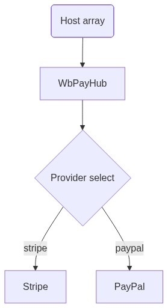

<p align="center">
  
</p>

<p align="center">
  <strong>Support hubs as data. Vue 2. Crypto + Fiat.</strong><br/>
  <em>One JSON array of providers. Live fiat + crypto tiles, copy-to-clipboard addresses, white-labelable branding. Ship a support page in minutes, not days.</em>
</p>

<p align="center">
<a href="https://www.npmjs.com/package/@wbc-ui2/pay"></a>
<a href="https://www.npmjs.com/package/@wbc-ui2/pay?activeTab=versions"></a>
<a href="https://github.com/wbc-ui2/pay/blob/main/LICENSE"></a>
<a href="https://vuejs.org"></a>
</p>

<p align="center">
  <a href="https://pay2.wbc-ui.com">📘 Docs</a> ·
  <a href="https://github.com/wbc-ui2/pay">🐙 GitHub</a> ·
  <a href="https://pay2.wbc-ui.com/lab">▶️ Playground</a> ·
  <a href="https://wbc-ui.com">💎 Pro</a>
</p>

<p align="center">
  
</p>

---

## Why?

**@wbc-ui2/pay** replaces the bespoke "Support me / Buy me a coffee / Donate crypto" page that every OSS maintainer and indie dev rewrites from scratch.

### Write a support page in one component

```javascript
// Before: per-provider tiles, per-network logic, per-tile QR code, custom copy-to-clipboard
// After: one <WbPayHub /> driven by data.
<WbPayHub :providers="PAYMENT_PROVIDERS" :product="'wb-code'" :recipient="ME" />
```

The component understands **fiat** providers (Stripe, PayPal, Wise, Payoneer, Skrill, Buy Me a Coffee, GitHub Sponsors) and **crypto** networks (BTC, ETH, USDC, SOL, Lightning) natively — uniform tile UI, clipboard-copy for on-chain addresses, new-tab open for hosted-checkout URLs.

### Host-owned data, package-owned UI

```javascript
// You curate the array. The package renders it. No vendored secrets, no shared addresses.
const PAYMENT_PROVIDERS = [
  { id: 'stripe',     label: 'Stripe',   icon: 'mdi-credit-card', url: 'https://...', kind: 'commercial' },
  { id: 'crypto-btc', label: 'Bitcoin',  icon: 'mdi-bitcoin',     address: { addr: 'bc1q...', network: 'bitcoin', format: 'bech32' } },
  { id: 'crypto-sol', label: 'Solana',   icon: 'mdi-currency-sign', address: { addr: '...',   network: 'solana',  format: 'base58' } },
  // ...
];
```

### Tiles dispatch on `kind` / `address`

```html
<!-- fiat tile → new-tab to provider URL on click, emits transaction-intent -->
<!-- crypto tile → copy-to-clipboard the address, shows network + format -->
<!-- expansion panels → optional steps[] / requirements[] arrays per provider -->
<WbPayHub :providers="MIXED_FIAT_AND_CRYPTO" :product="'wb-code'" :recipient="ME" />
```

### White-labelable branding

```javascript
// Pass your own gradient + accent colors per host app. The package ships only the renderer.
const BRANDING = {
  heroGradient: 'linear-gradient(135deg, #1a237e 0%, #311b92 100%)',
  accentColor:  'deep-purple',
  ctaButtonColor: 'deep-purple',
};
```

> **One component. One `<WbPayHub>` tag.** No per-provider component. No vendored addresses. Everything is data.

---

## What is @wbc-ui2/pay?

A **Vue 2.7+ component** that renders a polymorphic payment-provider grid from a single array of plain JSON descriptors. Pairs with `@wbc-ui2/core` but is independently installable.

| Surface | Role |
|---|---|
| `<WbPayHub :providers="..." :product="..." :recipient="...">` | The renderer — top-level component, expansion panels, copy-to-clipboard, analytics events |
| `PaymentProvider` interface | The host-owned data shape (fiat: `url` + `kind`; crypto: `address.{addr, network, format}`). Stable contract |
| Per-provider `steps[]` / `requirements[]` | Optional expansion-panel content for each tile — provider-specific copy and links |
| Default `pattern` slot | The package's built-in tile-grid layout. Overridable for white-label hosts |

**Who's it for?** OSS maintainers, indie devs, monetizing solo creators, and ecosystem packages that need a polished support / donation hub without rolling their own Vuetify card grid plus per-network logic.

---

## Usage Examples

### Level 1 — Single fiat tile
```javascript
<WbPayHub :providers="[
  { id: 'bmac', label: 'Buy Me a Coffee', icon: 'mdi-coffee', url: 'https://buymeacoffee.com/wbc-ui', kind: 'tip' }
]" :product="'wb-code'" :recipient="{ name: 'Wissem', contactEmail: 'me@wbc-ui2.com' }" />
```
→ Renders one tile. Click → opens `buymeacoffee.com/wbc-ui` in a new tab. Emits `transaction-intent` + `provider-opened` events. ½ second of typing.

### Level 2 — Mixed fiat + crypto

```html
<WbPayHub
  :product="'wb-code'"
  :providers="[
    { id: 'stripe',     label: 'Stripe',   icon: 'mdi-credit-card-outline', url: 'https://...', kind: 'commercial' },
    { id: 'crypto-btc', label: 'Bitcoin',  icon: 'mdi-bitcoin',
      address: { addr: 'bc1q...', network: 'bitcoin', format: 'bech32' } },
    { id: 'crypto-sol', label: 'Solana',   icon: 'mdi-currency-sign',
      address: { addr: '...',     network: 'solana',  format: 'base58' } }
  ]"
  :recipient="{ name: 'Your Name', contactEmail: 'you@example.com', taglineCommercial: 'Available for consulting.' }"
  :branding="{ heroGradient: 'linear-gradient(135deg, #1a237e 0%, #311b92 100%)', accentColor: 'deep-purple' }"
  @transaction-intent="onIntent"
  @provider-opened="onOpened"
/>
```

### Level 3 — With per-tile expansion content

```javascript
const PAYMENT_PROVIDERS = [
  {
    id: 'crypto-lightning',
    label: 'Bitcoin Lightning',
    icon: 'mdi-flash',
    address: { addr: 'me@walletofsatoshi.com', network: 'bitcoin-lightning', format: 'lightning-address' },
    steps: [
      'Open a Lightning wallet (Wallet of Satoshi, Phoenix, Strike)',
      'Send any amount of sats to the Lightning address above',
      'Confirmation in seconds, fees in cents'
    ],
    requirements: [
      'Recipient supports Lightning addresses (compatible with most modern wallets)',
      'For sub-$5 tips Lightning beats on-chain BTC by ~100× on fees'
    ]
  }
];
```
→ The tile expands on click to surface the `steps` and `requirements` lists. No extra props — the component dispatches on the presence of those keys.

---

## 🚀 Try it in 30 seconds

```bash
# Sandbox playground at pay2.wbc-ui.com (live interactive lab — paste any providers JSON, see it render)
open https://pay2.wbc-ui.com/lab
```

> While a starter template is being finalized, the easiest way to explore the component is the live demo at **[pay2.wbc-ui.com](https://pay2.wbc-ui.com)** — paste your own `PAYMENT_PROVIDERS` array, see the grid render in real time, copy the integration snippet back to your project.

---

## Installation

### Prerequisites

- **Node.js** ≥ 18 (the package declares this; older versions may work but are not tested)
- **Vue 2.7.x** (the component targets Vue 2 specifically; Vue 3 support tracked separately as `@wbc-ui3/pay`)
- **Vuetify 2.7.x** (used for `VCard`, `VBtn`, `VExpansionPanels`, `VIcon` primitives)
- A bundler that understands ESM exports: Vite (recommended), Webpack 5, or Vue CLI 5

### npm (recommended)

```bash
npm install @wbc-ui2/pay

# Peer dependencies — install once per project
npm install vue@^2.7.16 vuetify@^2.7.2
```

### Yarn / pnpm

```bash
# Yarn
yarn add @wbc-ui2/pay
yarn add vue@^2.7.16 vuetify@^2.7.2

# pnpm
pnpm add @wbc-ui2/pay
pnpm add vue@^2.7.16 vuetify@^2.7.2
```

### Vue 2 component registration

```javascript
// main.js — option 1: global registration
import Vue from 'vue';
import { WbPayHub } from '@wbc-ui2/pay';
Vue.component('WbPayHub', WbPayHub);
```

```javascript
// option 2: local registration (one component at a time)
import { WbPayHub } from '@wbc-ui2/pay';
export default {
  components: { WbPayHub },
  // ...
};
```

### Named imports

```javascript
import { WbPayHub } from '@wbc-ui2/pay';
```

### Pairs with @wbc-ui2/core

```javascript
// If you already use @wbc-ui2/core, WbPayHub can render inside a <WBC> tree:
<WBC :item="{
  comp: 'WbPayHub',
  options: {
    props: { providers: PAYMENT_PROVIDERS, product: 'wb-code', recipient: ME, branding: BRANDING }
  }
}" />
```

### Troubleshooting common install errors

| Symptom | Cause | Fix |
|---|---|---|
| `Vue.use is not a function` | Two copies of Vue are loaded (typically: your app has Vue 2, but a dependency hoisted Vue 3) | Pin a single Vue version: add `"resolutions": { "vue": "^2.7.16" }` (yarn/pnpm) or use npm `overrides`. Then `rm -rf node_modules && reinstall`. |
| `Cannot find module '@wbc-ui2/pay'` | npm couldn't resolve the package | Confirm install: `npm ls @wbc-ui2/pay`. If empty, `npm install @wbc-ui2/pay@latest`. |
| `peer dep missing: vuetify@^2` | Vuetify wasn't installed — it's a peer dep, not a hard one | `npm install vuetify@^2.7.2` (and any other peer deps the warning names). |
| Tiles render but unstyled | Vuetify CSS isn't loaded | Import once in `main.js`: `import 'vuetify/dist/vuetify.min.css';` |
| Crypto tile clipboard-copy silently fails | Browser blocks clipboard write outside a user-gesture context | Confirm the copy is triggered from a click handler; check console for `NotAllowedError`. |
| Hero gradient doesn't apply | `branding.heroGradient` value rejected by Vuetify | Pass a CSS-valid linear-gradient string starting with `linear-gradient(...)` — not a hex color. |

For a longer walkthrough with worked examples, see the documentation hub at [pay2.wbc-ui.com](https://pay2.wbc-ui.com).

---

## ⚡ The Component Under the Hood

<p align="center">
  
</p>

<details>
<summary>Mermaid diagram (interactive fallback)</summary>
<p align="center">
  
</p>
</details>

- **Polymorphic dispatch**: tiles dispatch on `kind` (fiat) vs presence of `address.*` (crypto) — no separate components to register
- **Host-owned data**: `providers` array is yours; the package vendors no URLs, no addresses, no defaults
- **Branding props**: `recipient` + `branding` flow into the hero block and tile styling; the default `pattern` is overridable for full white-label
- **Analytics events**: `transaction-intent` (fiat tile click) and `provider-opened` (after navigation / copy) — wire into your tracker of choice

---

## 💎 Free vs Pro

> **`@wbc-ui2/pay` is fully open-source today, and most of it will stay that way.** The free package is a complete support hub: provider tiles, expansion panels, clipboard-copy for on-chain addresses, branding props, custom `pattern` overrides. It is enough to run a real tip jar or donation hub for a personal project or OSS package.
>
> The Pro lane is intentionally narrow and **demand-driven** — we don't paywall speculatively. One Pro surface is currently planned because it's genuinely Pro-shaped (security-sensitive, hard to do correctly yourself); other Pro features will be added **only if real consumers ask for them**.

| Capability bucket | Free (today) | Pro (planned) |
|---|---|---|
| Fiat tile dispatch (Stripe, PayPal, Wise, Payoneer, Skrill, Buy Me a Coffee, GitHub Sponsors) | ✅ Full | ✅ Full |
| Crypto tile dispatch (BTC, ETH, USDC, SOL, Lightning, …) | ✅ Full | ✅ Full |
| Clipboard-copy for on-chain addresses | ✅ | ✅ |
| `transaction-intent` / `provider-opened` events | ✅ | ✅ |
| White-label `branding` props | ✅ | ✅ |
| Override the default `pattern` slot | ✅ | ✅ |
| **Server-side intent verification helper** *(planned)* — a small helper your backend imports to verify signed `transaction-intent` payloads, prevent tampered redirect URLs, and bind events to a maintainer-controlled secret | — | ✅ |

This is the **whole** Pro lane today. Maintainer review of additional Pro candidates is tracked in [packages/wb-pay/guides/monetize/](../guides/monetize/) — if you want a feature gated (or, more commonly, want a Pro feature *un*gated), open an issue.

👉 **[Monetization guide →](../guides/monetize/)** · **[Buy Pro (planned) →](https://pay2.wbc-ui.com/pricing)**

---

## 🌐 Ecosystem

`@wbc-ui2/pay` is a sibling package in the **@wbc-ui2** monorepo. Every package is published to npm and shares the same versioning line.

| Package | What it adds | Status |
|---|---|---|
| [`@wbc-ui2/core`](https://www.npmjs.com/package/@wbc-ui2/core) | "UI as Data" engine — the foundation | 🟢 GA |
| [`@wbc-ui2/code`](https://www.npmjs.com/package/@wbc-ui2/code) | Monaco-powered code editor | 🟢 GA |
| [`@wbc-ui2/chart`](https://www.npmjs.com/package/@wbc-ui2/chart) | ECharts integration | 🟢 GA |
| [`@wbc-ui2/dataviewer`](https://www.npmjs.com/package/@wbc-ui2/dataviewer) | JSON / data-table explorer | 🟢 GA |
| [`@wbc-ui2/latex`](https://www.npmjs.com/package/@wbc-ui2/latex) | LaTeX math rendering | 🟢 GA |
| [`@wbc-ui2/mermaid`](https://www.npmjs.com/package/@wbc-ui2/mermaid) | Diagram-as-code rendering | 🟢 GA |
| [`@wbc-ui2/alert`](https://www.npmjs.com/package/@wbc-ui2/alert) | Notification / toast system | 🟢 GA |
| [`@wbc-ui2/press`](https://www.npmjs.com/package/@wbc-ui2/press) | Markdown-driven docs engine | 🟢 GA |
| **[`@wbc-ui2/pay`](https://www.npmjs.com/package/@wbc-ui2/pay)** | **Fiat + crypto support hub component** *(this package)* | 🟢 GA |

---

## 📄 License

MIT © [Wissem Boughamoura](https://github.com/wissemb11) · [wi-bg.com](https://www.wi-bg.com) · [wbc-ui.com](https://wbc-ui.com)
